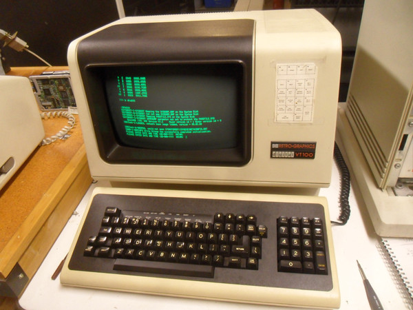

# Блок 1. Вводный. (Теория)

1. История развития компьютеров. Терминал как базовый способ управления программами.
2. Немного о языках программирования. В том числе о языке Python.

## История развития компьютеров. Терминал как базовый способ управления программами.

Когда компьютеры были огромными машинами (ЭВМ), которые иногда занимали целую комнату, для управления такой машиной использовали терминалы. Изначально в качестве терминалов применялись электромеханические телетайпы -- телеграфный аппарат с клавиатурой как у печатной машинки и бумажной лентой. Позже телетайпы были вытеснены терминалами на основе электронно-лучевой трубки. К компьютеру могло быть подключено несколько таких терминалов.

В современном компьютере мы имеем дело с **эмулятором терминала** -- программой, которая имитирует работу традиционного терминала. В таком терминале мы можем взаимодействовать с операционной системой компьютера через интерфейс **командой строки**, который является текстовым (всё взаимодействие осуществляется путём ввода текстовых команд). Графический же способ управления операционной системой (двигая курсор и нажимая на кнопки, отрисованные на экране) появился позже и стал основным для большинства пользователей, тем не менее командная строка остаётся незаменимой и продолжает активно использоваться.

Особенности командной строки (**CLI** - Command Line Interface) по сравнению с графическим интерфейсом (**GUI** - Graphical User Interface):
* Совершенно другой принцип работы, к которому нужно привыкнуть.
* Нужно знать названия команд, которые хочется использовать. Нет меню приложений с названиями и иконками.
* Отображение информации происходит в текстовом виде. Нет картинок, кнопок, интерактивных элементов.

Преимущества CLI:
* Интерфейс командной строки быстрее и эффективнее, так как на отрисовку графического приложения тратится время и задействуются вычислительные мощности.
* Многие операции в CLI можно выполнить быстрее, чем в GUI (если знать что именно нужно сделать и какие команды для этого использовать). В GUI почти все команды и программы спрятаны за несколькими открывающимися окнами и менюшками, на которые нужно наводиться курсором, ждать отрисовки окон, искать глазами следующую нужную кнопку, а в CLI команду можно выполнить написав одну строчку текста, что может быть гораздо быстрее при наличии достаточного опыта использования командной строки.
* В CLI можно оптимизировать и ускорять выполнение частых или однотипных операций (используя скрипты, регулярные выражения, специализированные команды и пр.), в то время как в GUI зачастую такой возможности нет.
* CLI приложения проще в разработке, поэтому много команд и приложений, для которых нет графического аналога.

Итого, командная строка -- очень мощный и удобный инструмент для выполнения многих задач. Но этим инструментом нужно научиться пользоваться. При этом стоит понимать, что есть задачи, в которых будет гораздо быстрее и удобнее пользоваться графическим интерфейсом. Так что для всякой задачи -- свой набор инструментов.

В сфере программирования командная строка используется очень активно и умение с ней работать будет большим подспорьем, а в некоторых ситуациях даже необходимостью.

## Немного о языках программирования.

Код, который непосредственно может исполнять компьютер -- **машинный код** (последовательность бинарных инструкций, то есть нулей и единиц). Писать машинный код напрямую очень сложно и долго, поэтому существует множество языков программирования -- человекочитаемых способов записи команд. Чтобы преобразовать текстовый файл с кодом, понятным человеку, в машинный код используется компилятор. Собственно язык программирования -- это договорённость, как правильно писать текстовый файл с программой, плюс программа-компилятор, которая умеет преобразовать правильно написанные текстовые файлы в машинный код.

Языки программирования, в которых человеческий код почти дословно переводится в машинный код, называются **низкоуровневыми**. На таких языках удобно писать алгоритмы, которые должны выполняться быстро, эффективно и не использовать слишком много памяти компьютера. Но такие языки очень многословны -- приходится очень подробно писать все действия, которые необходимо сделать компьютеру. А ещё на низкоуровневых языках программа зачастую пишется под конкретный процессор со всеми его особенностями, и для разных компьютеров с разными процессорами приходится одну и ту же программу писать по-разному. Существуют и **высокоуровневые языки программирования**. В них за простым описанием программы может быть скрыто огромное количество низкоуровневых операций и алгоритмов. Высокоуровневые языки программирования нужны для кроссплатформенности: чтобы написанные программы можно было скомпилировать для разных процессоров. Но при такой универсальности падает эффективность.

Языки программирования бывают **компилируемыми** и **интерпретируемыми**. В компилируемых языках программа-компилятор преобразует текст программы в машинный код, который можно потом запускать на компьютере не имея самого компилятора. У интерпретируемых же языков есть программа-интерпретатор, которая расшифровывает и выполняет написанную человеком программу, когда её непосредственно запустили. Такой подход помогает ускорить и сделать более эффективным выполнение высокоуровневых команд, оптимизируя их в процессе выполнения.

### Язык Python

Python -- высокоуровневый, интерпретируемый язык программирования. Сейчас этот язык один из самых популярных. Благодаря своему простому синтаксису и хорошей читаемости кода для многих начинающих он становится первым языком программирования. А опытные программисты выбирают его для своих проектов из-за быстроты написания кода и огромного количества библиотек в разнообразных направлениях разработки.
