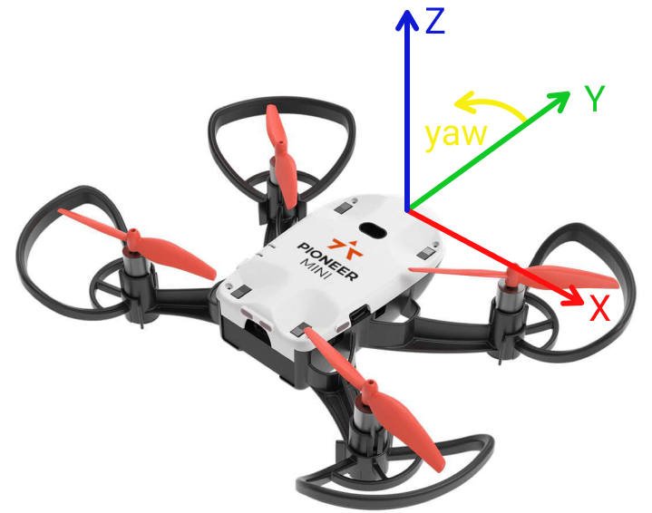

# Блок 3. (Теория)

## Способы задания системы координат. Оптический поток.
Системы координат могут быть заданы по-разному, например: радиомаяками, GPS-спутниками или визуальными метками, относительно которых дрон и вычисляет свои координаты. Но есть ещё способ задать систему координат, не используя никаких внешних ориентиров -- система оптической навигации (навигация по оптическому потоку (optical flow)). На квадрокоптере есть специальная камера, направленная вниз. Анализируя смещение пикселей на последовательных кадрах и зная высоту над поверхностью, бортовой компьютер вычисляет перемещение дрона в метрах. При навигации по оптическому потоку система координат фиксируется во время взлёта, то есть началом координат будет место взлёта, а направление осей координат зафиксируется в зависимости от положения дрона во время взлёта. У дрона оси направлены: `Y` -- вперёд, `X` -- вправо, `Z` -- вверх.

Оптический поток хорош тем, что нам не нужны внешние приборы для задания системы координат. Но такой способ вычисления координат менее точен (по сравнению с другими, использующимися в помещении) и в нём неизбежно накапливается ошибка.

