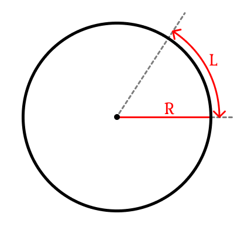

# Блок 3. (Теория)

## Радианная мера угла

### Градусы

В начальной школе все проходили градусную меру угла, в которой один полный оборот составляет 360*. Почему именно 360* -- есть несколько теорий, но точно нам не известно. Особой математической обоснованности делить круг на 360 частей нет, с тем же успехом мы могли бы делить его на 100 или 1000 частей.

### Радианы

Есть альтернативная мера угла -- радианы. В ней мы привязываемся к длине дуги `L`, которую отсекает центральный угол. Но если мы будем брать окружности разного размера, то для одного и того же угла будет получаться разная длина отсекаемой дуги. Но если длину окружности `L` поделить на радиус `R`, то такая величина при одном и том же угле будет одинаковой для всех окружностей (в евклидовой геометрии). Например, если окружность увеличить в 2 раза (радиус увеличить в 2 раза), то длина окружности тоже увеличится в 2 раза и дробь $\frac{2L}{2R}=\frac{L}{R}$ останется прежней.

Такая величина $\frac{L}{R}$ является радианной мерой угла. Угол, равный 1 радиану -- угол, отсекающий дугу, равную радиусу. 

Поскольку длина окружности равна $2\pi R$, то полный оборот будет равен $\frac{2\pi R}{R}=2\pi$ радиан. А прямой угол -- $\frac{2\pi}{4} = \frac{\pi}{2}$ радиан.