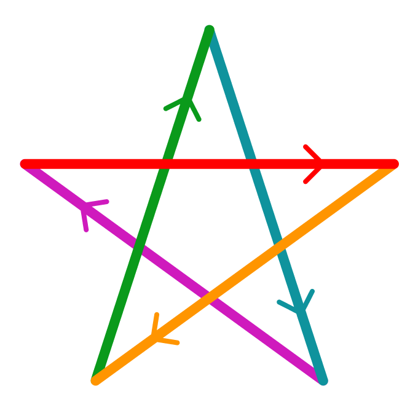

# Блок 4. Расчёт координат. (Задания)

## Полёт по пятиконечной звезде
Написать программу для полёта по пятиконечной звезде (длина одного звена ломаной -- 1 м).\
***Вариант 1:*** с поворотами (лететь всегда "лицом" вперёд).\
***Вариант 2:*** без поворотов (лететь смотря в одну и ту же сторону).

