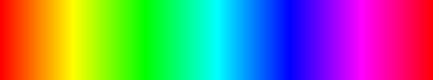

# Блок 9. OpenCV. HSV. (Задания)

(Во всех заданиях открытые окна должны закрываться по нажатию либо клавиши `Esc`, либо клавиши `q`.)

## Спектр
Вывести на экран спектр цветов из модели HSV.\
(Весь диапазон значений Hue при фиксированных максимальных значениях Saturation и Value).

Чтобы картинка получилась не маленькая, каждое значение Hue в ширину должно занимать 3 пикселя

Должно получиться вот такое изображеие.

## Вывод значения Hue на спектре
Вывести на экран спектр. В левом верхнем углу чёрным цветом должно быть написано значение Hue того пикселя, который сейчас под курсором. А столбец пикселей, на который наведён курсор должен быть выделен чёрным.

(Если курсор находится не на изображении, то значение можно оставить последним написанным, или его не писать).

## Выбор диапазона
Вывести на экран спектр. При нажатии мышью выбирается первое значение Hue (выбранный столбец выделяется чёрным). Пока клавиша мыши нажата идёт выбор второго значения Hue (столбец выделяется чёрным). Когда клавиша мыши отпускается второе значение Hue считается выбранным (столбец выделяется чёрным). Когда выбор диапазона сделан, в консоль выводятся выбранные границы этого диапазон (сначала меньшее число, затем большее).

Должна быть возможность не перезапуская программу выбрать диапазон ещё раз.
