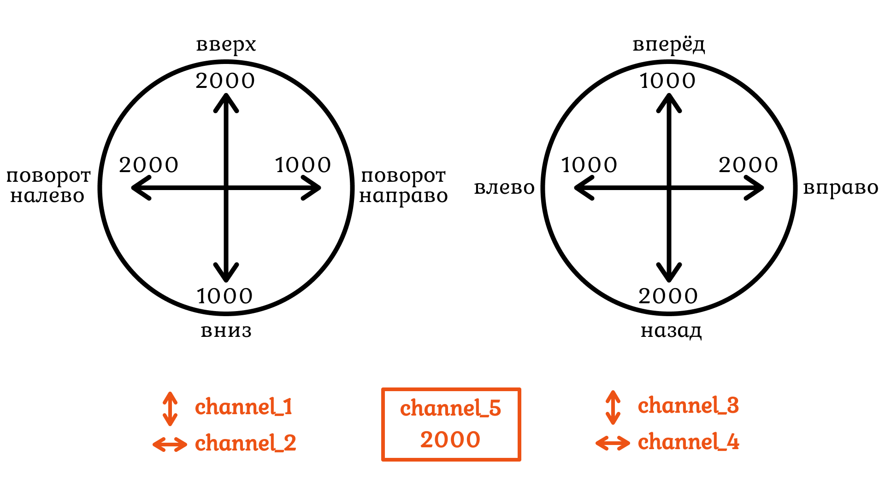

# Блок 10. `RC_channels`. (Заметки)

Функция `send_rc_channels()` отправляет на квадрокоптер пакет со значениями для 8 каналов (в аргументах можно указывать не все 8, а только нужные первые N каналов). Значения для каналов указываются в диапазоне `1000-2000`.



Реальный пульт отправляет на квадрокоптер занчения постоянно, а если сообщений нет, то квадрокоптер считает, что связь с пультом разорвана. Поэтому для управления квадрокоптером через `send_rc_channels()` команду нужно отправлять постоянно.


```python
while True:
    ch_1 = 1500
    ch_2 = 1500
    ch_3 = 1500
    ch_4 = 1500
    ch_5 = 2000
    drone.send_rc_channels(ch_1, ch_2, ch_3, ch_4, ch_5)
```

[Документация. `send_rc_channels()`](https://docs.geoscan.ru/pioneer/programming/python/pioneer-sdk-methods.html#send_rc_channels)