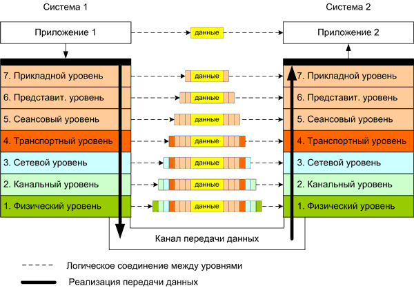

# Блок 10. `RC_channels`. (Теория)

## Радиосигналы

Почти всё, что у нас есть бесконтактное и беспроводное (Wi-Fi, радиопульт, беспроводная зарядка, микроволновка) работает за счёт электро-магнитных волн. При генерации электро-магнитной волны, у неё можно изменять амплитуду, частоту или фазу, и тем самым зашифровывать информацию. Радиосигнал может быть аналоговым: например, радио (AM, FM). При амплитудной модуляции -- AM (Amplitude Modulation) берётся радиоволна фиксированной частоты и изменяется амплитуда, повторяя звуковой сигнал с микрофона, приёмник принимает такой сигнал и воспроизводит звуковую волну, вот так заданную амплитудой. При частотной модуляции FM (Frequency Modulation) амплитуда у радио-волны постоянная, а изменяется частота. Также радиосигнал может быть цифровым: в таком случае электро-магнитной волной кодируются 0 и 1, и передавая последовательности битов мы передаём цифровой сигнал, который уже по какому-нибудь правилу (протоколу) будет преобразован в нужную информацию.

## Протоколы передачи информации.

**Протокол передачи данных - это набор правил и соглашений, определяющих, как передавать информацию друг другу.** Договорённости могут быть устроены по-разному. Например, если договориться передавать в классе бумажные записки, и чтобы на первых двух строчках записки было написано от кого и кому это сообщение предназначается, а если человека в классе нет, то записку нужно вернуть тому, кто её написал, то такую договорённость тоже можно назвать протоколом передачи информации.

Чтобы передавать информацию нужно договориться много о чём. Например:\
* по какому каналу связи будет передаваться информация (голубиная почта, сигнал по проводу, радиосигнал, бумажное письмо по почте, ...);
* как узнать и что делать, если сигнал не дошёл или пришёл с ошибкой (голубь потерялся, бит пришёл не тот);
* как сделать так, чтобы сообщение по сети дошло до получателя (через какие почтовые отделения должно пройти письмо / через какие маршрутизаторы);
* что делать, если нужно отправлять несколько сообщений, как выстроить их в правильном порядке, что делать с потерянными сообщениями;
* как расшифровать полученную информацию (какая кодировка использовалась, если это картинка, то в каком она формате, ...);
* как понять, что и где в сообщении находится (где в сообщении текст, на каком он языке, где картинка, и к чему относится данная картинка).

Чтобы всеми этими договорённостями было удобно пользоваться, их разделили на уровни, и на каждом уровне решается своя задача. Например, можно одинаково кодировать картинки, но по-разному передавать их по сети. Разделение на уровни описано в [сетевой моделе OSI](https://ru.wikipedia.org/wiki/%D0%A1%D0%B5%D1%82%D0%B5%D0%B2%D0%B0%D1%8F_%D0%BC%D0%BE%D0%B4%D0%B5%D0%BB%D1%8C_OSI).

Когда мы поочереди применяем договорённости с разных уровней, это можно сравнить с упаковывением сообщения во вложенные конвертики. Сначала одно приложение упаковало текст в нужный формат, чтобы другое приложение смогло его понято. Затем получившийся текст преобразовали в наборы байтов, используя заранее выбранную кодировку, чтобы другой компьютер правильно преобразовал эти байты обратно в текст. Затем эти байты разбили на небольшые фрагменты, чтобы отправить их отдельными сообщениями. Для каждого фрагмента подписали IP адрес получателя и IP адрес отправителя, номер фрагмента и много чего ещё, и вот у нас уже новый набор байтов, содержащий всю эту информацию. Этот набор байтов, дополнительно применив ещё в парочку протоколов, чтобы оно дошло на нужный роутер или маршрутизатор, отправляем по проводу, используя договорённости о том, как нужно подавать напряжение, чтобы передать 1 и 0. Другой компьютер считывает напряжение, получает из него нужные биты и начинает распаковывать всё это в обратном порядке, чтобы приложение на этом компьютере смогло получить свой текст, который ему отправили.

## Управление через радио-пульт

Радиопульт в основном задействует только нижние уровни модели OSI. У нас есть договорённость, как излучать и принимать радиосигнал, как из этого радиосигнала получить биты информации (0, 1), как понять, где начало сообщения и где конец. А само сообщение предвтавляет из себя просто набор чисел. Например, если пульт передаёт 5 каналов, то каждое сообщение будет содержать 5 чисел.

Чтобы передать с пульта положение двух стиков, нам нужно 4 канала (два стика, у каждого есть положение по оси X и по оси Y). Если добавить ещё канал, то можно переавать ещё какую-нибудь информацию, например, положение какого-нибудь тумблера, или режим, в котором квадрокоптер должен летать.

Пульт постоянно отправляет сообщения, а приёмник постоянно принимает сообщения. Таким образом приёмник постоянно получает актуальные значения для каждого канала, а если сообщения перестали приходить, то значит связь с пультом потеряна.

[Документация Geoscan. Радиоаппаратура управления.](https://docs.geoscan.ru/pioneer/database/const-module/radio/radio-1.html)

## Имитация управления через радиопульт

Чтобы управлять квадрокоптером программно, мы подключаемся к нему по Wi-Fi (использование Wi-Fi уже задействует протоколы с физического до сетевого) и по протоколу TCP отправляем сообщения в формате Mavlink (библиотека pioneer_dsk отправляет дрону сообщения по протоколу Mavlink).

Когда мы отправляем RC-каналы через pioneer_sdk, то те самые 5 (или не 5) чисел, которые отправлял бы радио пульт, мы упаковывем в кучу разных протоколов и отправляем сложным путём. Но тем не менее они доходят до автопилотиа и он их интерпретирует так же, как если бы они пришли с радио пульта.